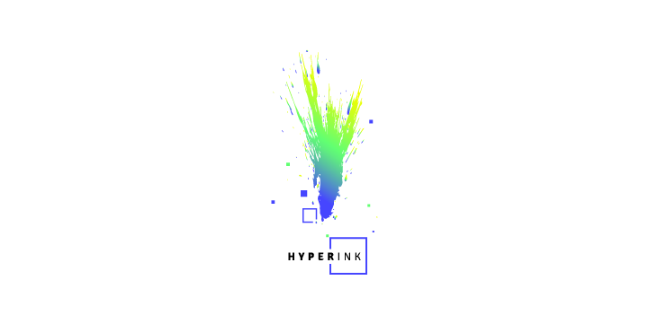

# Hyperink-Website

Sito vetrina della associazione culturale Hyperink, nato con lo scopo di trasmettere al pubblico tutti gli aggiornamenti del associazione e di tutti i suoi progetti in fase di sviluppo.

Website Online : https://www.hyperink.it

## Team di lavoro

Web Design : _Lorenzo Piazzi_

Front-End Developer : _Franco Joel Ticona Chata_

Back-End Developer : _Arianna Parisi_

### Linguaggi Utilizzati

HTML - Pure CSS - JAVASCRIPT - PHP
